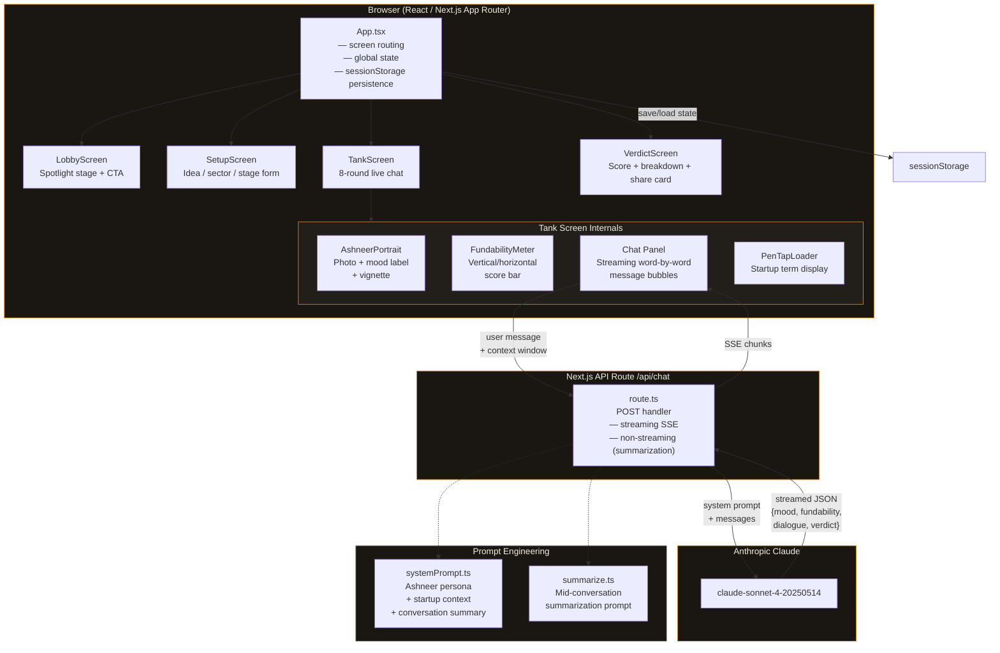

# Pitch Tank India

An AI-powered Shark Tank India simulator where you pitch your startup idea to Ashneer Grover. He listens, reacts, pushes back, and gives you a brutally honest verdict  complete with a fundability score, breakdown, and a shareable result card.

Built with Next.js 14, the Anthropic API (Claude), and pure CSS — no component libraries.

## What it does

1. **Lobby** — Theatrical entry with a spotlight stage and typewriter intro.
2. **Setup** — You describe your idea, pick a sector/stage, and share strengths and weaknesses.
3. **The Tank** — A live conversation with Ashneer (8 rounds). His mood, portrait border, and fundability meter update in real-time based on how your pitch lands.
4. **Verdict** — A final score (0–100), zone verdict, detailed breakdown (what impressed, what didn't, what to fix), a closing monologue, and a downloadable share card.

Everything is in Ashneer's signature Hinglish voice. The chat persists across reloads, Ashneer speaks first, and the background warms up as his mood shifts.

## Why this topic

Lately I've been going through a lot of startup ideas and watching Shark Tank India obsessively. I kept thinking  what if I could stress-test my ideas before actually pitching them?

Ashneer Grover was the obvious choice. Nobody gives more brutal, specific, honest feedback. And that honesty is actually useful not discouraging, just real.

So I built the thing I personally wanted to use.

## Architecture



### Screen flow

```
Lobby ──→ Setup ──→ Tank (8 rounds) ──→ Verdict
  ↑                   │                    │
  └───────────────────┘ (exit)             │
  └────────────────────────────────────────┘ (new pitch)
```

### Key data flow

1. **Setup → Tank** — `StartupData` (idea, sector, stage, strength, weakness) is injected into the system prompt.
2. **Tank ↔ API** — Each user message is sent with the system prompt + conversation context. Claude returns structured JSON (`mood`, `fundability`, `dialogue`, optional `verdict`).
3. **Context management** — After 8 messages, a background summarization call compresses history. Subsequent calls use summary + a sliding window of recent messages.
4. **Persistence** — `App.tsx` saves the full session (screen, messages, mood, fundability, summary, verdict) to `sessionStorage` on every state change and restores on reload.

## Tech stack

- **Framework** — Next.js 14 (App Router), TypeScript
- **AI** — Anthropic Claude (`claude-sonnet-4-20250514`) with streaming SSE
- **Styling** — Custom CSS variables, inline styles, CSS keyframe animations
- **Fonts** — Playfair Display + DM Sans (Google Fonts via `next/font`)
- **State** — React hooks + `sessionStorage` for persistence
- **Deployment** — Vercel-ready

## Running locally

```bash
npm install
```

Create a `.env.local` file:

```
ANTHROPIC_API_KEY=your_key_here
```

Then start the dev server:

```bash
npm run dev
```

Open [http://localhost:3000](http://localhost:3000).
